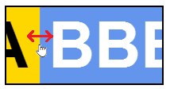

# deliteful/SwapView

`deliteful/SwapView` is a container that extends `deliteful/SwapView` and adds user interactions:
- You can show the next or previous child using a swipe gesture (with the finger on touch devices, or the mouse on
desktop).
- You can also use the Page Up/Down keyboard keys to go the next/previous child.

During a swipe interaction, the next/previous child is partially shown next to the current child and both
children slide following the finger/mouse position:



If you swipe by more than the value of the `swapThreshold` property, the next/previous child is shown with a
slide transition. If you swipe less than the `swapThreshold`, the current child slides back to its initial
position.

##### Table of Contents
[Element Instantiation](#instantiation)  
[Element Configuration](#configuration)  
[Element Styling](#styling)  
[Enterprise Use](#enterprise)  

<a name="instantiation"></a>
## Element Instantiation

A SwapView is created like a ViewStack.

See [`delite/Widget`](/delite/docs/master/Widget.md) for full details on how instantiation lifecycle is working.

### Declarative Instantiation

```js
require(["delite/register", "deliteful/SwapView", "requirejs-domready/domReady!"], function (register) {
  register.parse();
});
```

```html
<html>
  <d-swap-view style="width:100%; height:200px">
    <div style="background-color: darkblue">Child 1 (Default visible child)</div>
    <div style="background-color: white">Child 2</div>
    <div style="background-color: crimson">Child 3</div>
  </d-swap-view>
</html>
```

### Programmatic Instantiation

```js
require(["deliteful/SwapView", "requirejs-domready/domReady!"], function (SwapView) {
  var sv = new SwapView({style: "width:100%; height: 200px"});
  var child1 = document.createElement("div");
  var child2 = document.createElement("div");
  var child3 = document.createElement("div");
  sv.addChild(child1);
  sv.addChild(child2);
  sv.addChild(child3);
  sv.placeAt(document.body);
  sv.startup();
});
```

<a name="configuration"></a>
## Element Configuration

See [`delite/ViewStack`](/delite/docs/master/ViewStack.md) documentation for configuration of the ViewStack base class.

### Properties

The `swapThreshold` property defines the amount of swiping necessary to change the visible child. It is a
value between 0 and 1 and corresponds to a fraction of the SwapView width. By default, `swapThreshold` is 0.5, which
means that you must swipe by more than half the size of the SwapView to change the visible child.

<a name="styling"></a>
## Element Styling

`deliteful/SwapView` has no visual appearance, it does not provide any CSS class for styling.

See [`delite/ViewStack`](/delite/docs/master/ViewStack.md) documentation for styling of the ViewStack base class.

<a name="enterprise"></a>
## Enterprise Use

### Accessibility

ViewStack provides keyboard accessibility support: pressing the Page Up key shows the next child,
pressing Page Down shows the previous child.

### Globalization

`deliteful/SwapView` does not provide any internationalizable bundle.

Right to left orientation is supported by setting the `dir` attribute to `rtl` on the `deliteful/SwapView` element.
It affects the swipe interaction.

### Security

This widget has no specific security concern. Refer to [`delite/Widget`](/delite/docs/master/Widget.md) for general security advice on this base class that `deliteful/SwapView` is using.

### Browser Support

This widget supports all supported browsers. On Internet Explorer 9, transitions are not animated.
